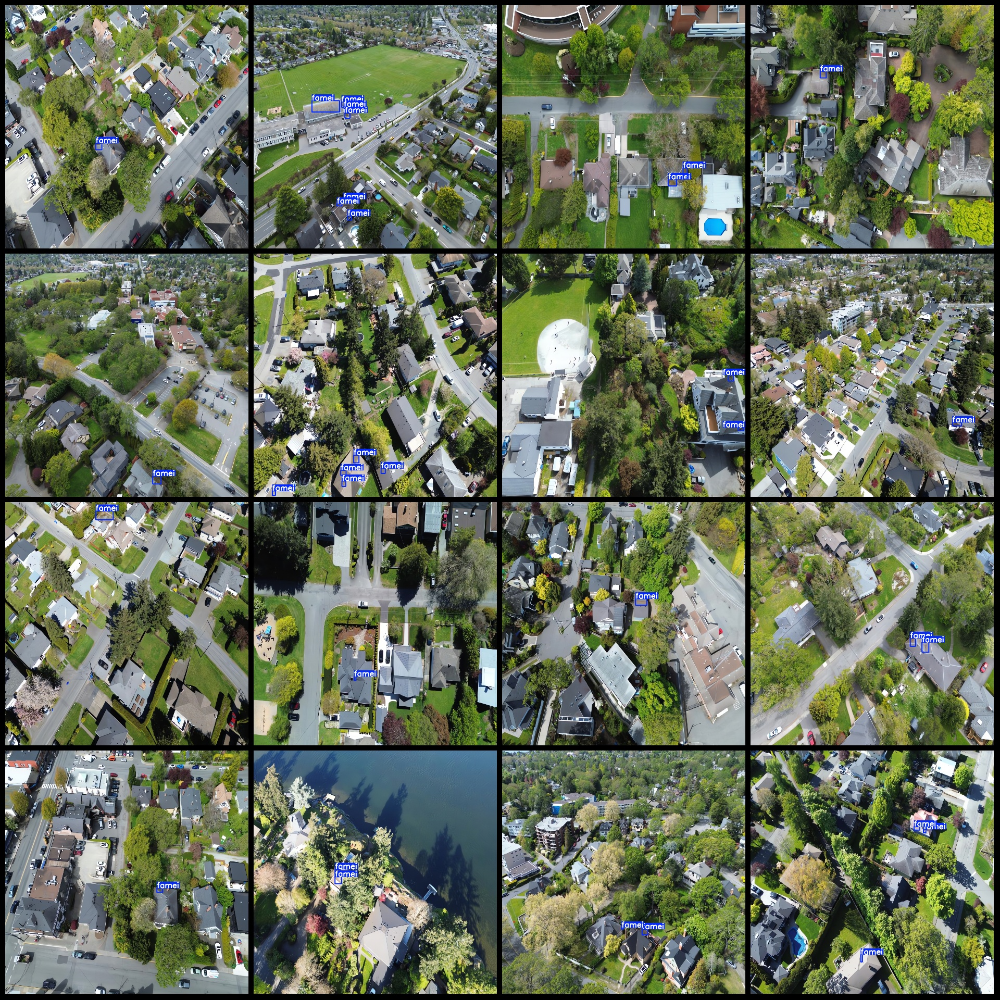
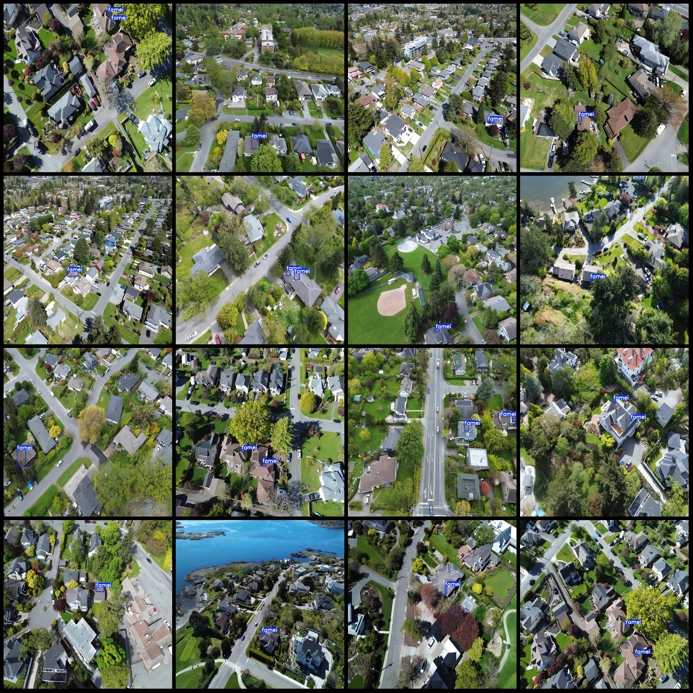

# UAV Perspective Roof Mold Detection Dataset VOC+YOLO Format with 62 Images in 1 Category

Dataset format: Pascal VOC format + YOLO format (txt file without split path, only containing jpg images and corresponding VOC format xml files and YOLO format txt files)
Number of images (jpg file count): 62
Number of annotations (xml file count): 62
Number of annotations (txt file count): 62
Number of categories: 1
Annotation category name: ["famei"]
Number of bounding boxes per category:
- Famei (Mold) = 142
Total bounding boxes: 142
Number of images per category:
- Famei (Mold) = 62
Image resolution: 1280x1280
Annotation tool used: labelImg
Drone: DJI MAVIC 3
Collection height: 100m
Collection angle: 80-90°
Annotation rules: Draw a rectangle around the category
Important note: The dataset does not have a split for training, validation, or testing; you need to divide it yourself.
Special declaration: This dataset does not guarantee the accuracy of the trained models or weight files.
Image preview:

## Images

Here is a pay link on Stripe ( https://buy.stripe.com/3cs8yP7sY87d0vu9AB ). Please contact me lonlonago@foxmail.com after funding $89, and I will send you a complete data files , thank you!

